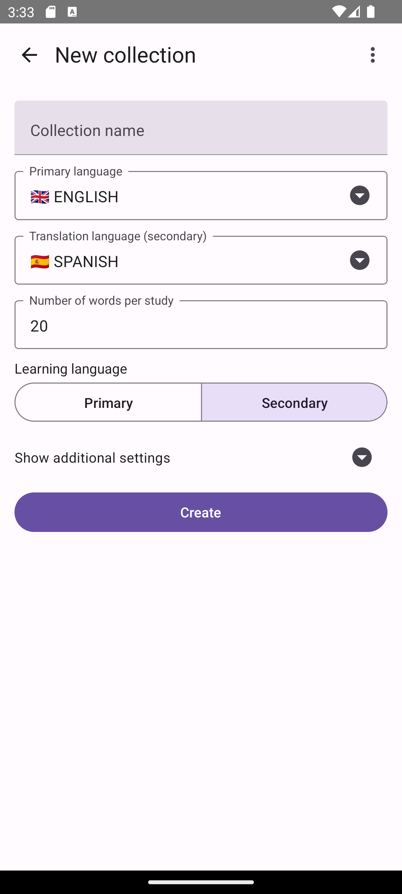
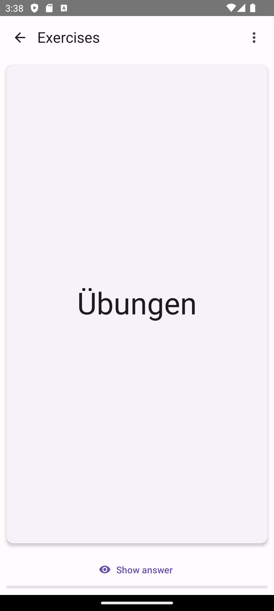

# Wordum 

## Overview

Wordum is a powerful language learning application designed to help users expand their vocabulary through interactive flashcards. Built with [React Native](https://reactnative.dev), Wordum offers a seamless experience for learners of all levels. 

### Current Status

Wordum is currently in public beta. Any contributions to expand the app to other platforms (only Android phones are currently supported) or to help fix translations (all app's locales except `en` and `ru` are autogenerated) are highly welcomed. 

## Demos

|  |  |  |  |
|---|---|---|---|

## Main features

- **Flashcard Collections**: Create and manage collections of flashcards tailored to your learning needs.
- **Automatic Field Filling**: Simply input a word or phrase, and the app will automatically populate translation, audio, and usage examples.
- **Diverse Learning Exercises**: Engage with various exercises, including listening and writing, to reinforce your learning.
- [**Open Spaced Repetition Algorithm**](https://github.com/open-spaced-repetition/fsrs4anki/wiki/The-Algorithm): Utilizes the same effective learning algorithm as the popular [Anki app](https://github.com/ankitects/anki) to optimize your study sessions.
- **Open Source**: Wordum is completely open source and [licensed under GPL3](./LICENSE), encouraging collaboration and contributions from the community.

## Known issues

- no tablet resolution support
- There is a possibility to press the system's back button on an android phone
- An android keyboard suggests words for autocompletion during writing practice
- Values in selects are not translated
- app's icon (is too generic and also) doesn't support Android Adaptive icons
- translation script is incompatible with text formattings/links
- no accessibility support
- [you name it](https://github.com/besdar/wordum/issues)

## Features wishlist

- notification about exercises
- rating of a word/phrase (how often it is used)
- automatic github release pipeline
- F-Droid publication
- random emotional support cards during exercises
- cloud backup support
- web support
- predefined collections after the installations like: 100 most popular words
- [you name it](https://github.com/besdar/wordum/issues) 😉

## License

Wordum is licensed under the GPL-3.0 license. For more details, please refer to the [LICENSE](./LICENSE) file.
